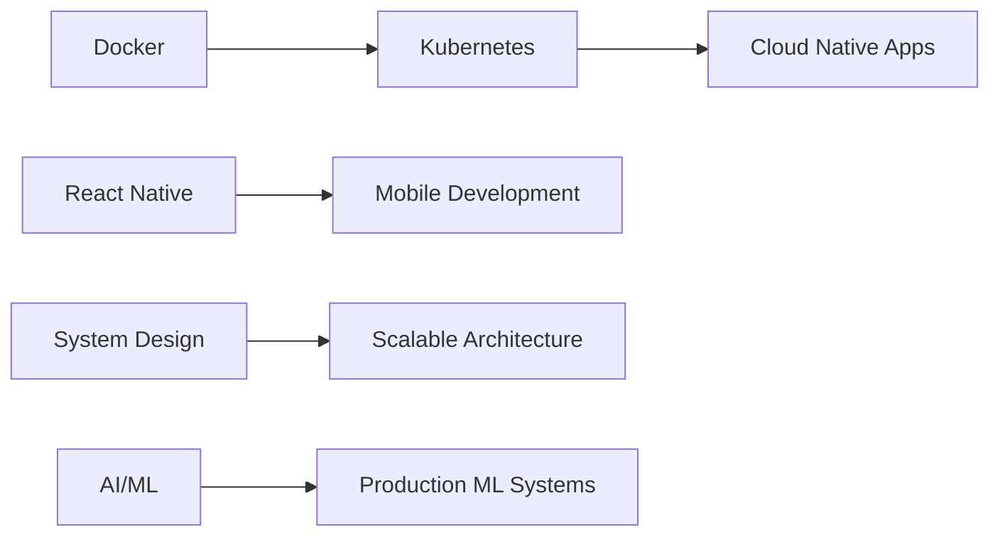

<div align="center">

# 👨‍💻 Avinash Maurya

### Full Stack Developer | DevOps Enthusiast | AI/ML Explorer


[](https://github.com/LAZY-CODER01)
[](https://linkedin.com)
[](mailto:avinashstudy01@gmail.com)
[](https://leetcode.com)


</div>

---

## 🚀 About Me

```yaml
name: Avinash Maurya
location: Varanasi, Uttar Pradesh, India
role: Full Stack Developer & DevOps Solutions Architect
education: 
  - degree: "B.Tech in Computer Science & Engineering"
    institution: "Madan Mohan Malaviya University of Technology, Gorakhpur"
    year: "2023-2027"
    
experience:
  - position: "Full Stack Developer Intern"
    company: "Multiqo Concept Private Limited"
    duration: "Apr 2025 - Jul 2025"
    location: "Lucknow, India"
    achievements:
      - "Served 1,000+ active users with MERN stack platform"
      - "Reduced API response time by 30%"
      - "Increased mobile conversion by 25%"
      - "Processed Rs.5+ lakh in revenue"

current_focus:
  - "Docker & Kubernetes orchestration"
  - "React Native mobile development"
  - "AI/ML integration in production systems"
  - "System Design & Architecture"

2025_goals:
  - "Create 25+ production-ready projects"
  - "Master 5-10 new technologies"
  - "Contribute to open-source"
  - "Build AI-powered automation tools"

interests: 
  - "🌐 Web Development (Full Stack)"
  - "🤖 AI/ML & Data Science"
  - "🎨 UI/UX Design"
  - "🎮 Game Development"
  - "☁️ DevOps & Cloud Architecture"

hobbies: ["🎮 Gaming", "🎬 Cinema", "📚 Books", "🎨 Art", "😄 Comedy", "✈️ Travelling"]
```

---

## 💼 Professional Experience

<details open>
<summary><b>Full Stack Developer Intern @ Multiqo Concept Pvt. Ltd.</b> (Apr 2025 - Jul 2025)</summary>
<br>

🎯 **Key Achievements:**
- 🚀 Designed and deployed scalable **MERN stack e-commerce platform** serving **1,000+ active users**
- ⚡ Engineered **15+ RESTful APIs**, reducing response time by **30%**
- 📱 Built responsive UI with **React.js & Tailwind CSS**, improving performance score from **62 → 89**
- 💰 Integrated **Razorpay payment gateway**, processing **Rs.5+ lakh revenue** in 8 months
- 🔒 Implemented **JWT authentication** and **role-based access control**
- ⏱️ Maintained **99.9% uptime** through CI/CD pipelines and proactive monitoring

</details>

---

## 🛠️ Featured Projects

### 🤖 AI-Powered Quotation Automation System
[](https://github.com/LAZY-CODER01/quotation_backend_windows)

**Tech Stack:** Python | LLM | OCR | RAG | MotherDuck | OpenPyXL

- 📄 Built end-to-end automation pipeline extracting structured data from PDFs, Excel, and scanned images
- ⚡ **Reduced manual processing time by 80%** across 200+ monthly requests
- 🎯 Achieved **95%+ field extraction accuracy** using OCR (Tesseract) and schema-controlled LLM workflow
- 🔍 Implemented **RAG-based recommendation engine** improving quotation relevance by **40%**
- ⏱️ Cut quotation turnaround from **2 hours → 5 minutes**
- 🛡️ Architected event-driven processing with retry mechanisms achieving **zero data loss** across 500+ documents

**Key Features:**
- Multi-format document processing (PDF, Excel, Images)
- Vector embeddings & cosine similarity for product recommendations
- Asynchronous processing with robust error handling
- Auto-generated formatted Excel quotations

---

### 📝 Automation-Blog: AI Content Platform
[](https://github.com/LAZY-CODER01/Workflow-Automation)

**Tech Stack:** Next.js | Node.js | TypeScript | PostgreSQL | Redis | Kafka | Prisma | Gemini API

- 🚀 Built AI-driven content automation platform reducing content creation time by **70%**
- 📰 Generates **50+ articles/week** autonomously
- 🔄 Automated multi-source content discovery processing **500+ posts/day**
- 📊 ML feedback loop improved article quality score by **35%** over 4 weeks
- ⚙️ Deployed Redis caching & Kafka queues supporting **10x throughput scaling**

**Key Features:**
- Multi-source content aggregation (Reddit, APIs)
- Google Gemini API for intelligent article generation
- Admin dashboard with role-based authentication
- Content review workflows via Prisma ORM
- Scalable microservices architecture

---

### 🛒 E-Commerce Platform (Multiqo)
**Tech Stack:** MongoDB | Express.js | React.js | Node.js | Razorpay | JWT

- 💳 Full-featured e-commerce platform with secure payment integration
- 👥 Serving **1,000+ active users** with real-time order processing
- 🔐 JWT-based authentication with role-based access control
- 📱 **25% increase** in mobile conversion rate
- 📈 **99.9% uptime** across 3+ environments

---

## 💻 Technical Arsenal

### Languages


### Frontend Development


### Backend Development


### Databases & Cloud


### DevOps & Tools


### AI/ML & Data


---

## 🎯 Areas of Expertise

<table>
  <tr>
    <td valign="top" width="50%">

### 🤖 AI/ML & Automation
- RAG (Retrieval Augmented Generation)
- LLM Integration & Prompt Engineering
- OCR & Document Processing
- Vector Embeddings & Similarity Search
- Machine Learning Pipelines (scikit-learn)
- ETL Pipelines & Data Transformation

</td>
<td valign="top" width="50%">

### 🏗️ System Design & Architecture
- RESTful API Design
- Microservices Architecture
- Event-Driven Systems
- JWT Authentication & Security
- Caching Strategies (Redis)
- Message Queues (Kafka)
- Asynchronous Processing

</td>
  </tr>
</table>

---

## 📊 GitHub Statistics

<div align="center">


</div>

<div align="center">

[](https://git.io/streak-stats)

</div>

---

## 🏆 Achievements & Competitive Programming

<div align="center">

| Platform | Achievement | Rating/Score |
|----------|-------------|--------------|
| 💻 **LeetCode** | 310+ Problems Solved (DSA, DP, Graphs) |  |
| ⭐ **CodeChef** | 3-Star Coder | Max Rating: **1607** |
| 🎯 **Codeforces** | Pupil | Max Rating: **1293** |

[](https://leetcode.com/LAZY-CODER01)

</div>

---

## 🎓 Education

**Madan Mohan Malaviya University of Technology, Gorakhpur**  
*B.Tech in Computer Science & Engineering* | 2023-2027

**Relevant Coursework:**
- Data Structures & Algorithms
- Object-Oriented Programming (OOP)
- Database Management Systems (DBMS)
- Computer Networks
- Operating Systems
- System Design

---

## 🌟 Leadership & Responsibilities

**President** - Coders And Developers Club  
*April 2025 - March 2026*

- Leading technical workshops and coding sessions
- Organizing hackathons and tech events
- Mentoring junior developers
- Building collaborative learning community

---

## 📈 Contribution Graph

[](https://github.com/LAZY-CODER01)

---

## 🎯 Current Learning Path



**Currently Exploring:**
- 🐳 Docker & Container Orchestration
- ☸️ Kubernetes for Production Deployment
- 📱 React Native for Cross-Platform Mobile Apps
- 🧠 Advanced AI/ML Integration Patterns
- 🏗️ Distributed Systems & Microservices

---

## 💡 Fun Facts About Me

- 🎮 Avid gamer with a passion for strategy and RPG games
- 🎬 Film enthusiast who loves analyzing cinematography and storytelling
- 📚 Constantly reading tech blogs, documentation, and sci-fi novels
- 🎨 Appreciate good design and user experience
- ✈️ Love exploring new places and cultures
- 💻 Believe in clean code, good documentation, and continuous learning

---

## 📫 Get In Touch

<div align="center">

[](mailto:avinashstudy01@gmail.com)
[](mailto:2023021126@mmmut.ac.in)
[](https://github.com/LAZY-CODER01)
[](https://linkedin.com)

**📍 Location:** Varanasi, Uttar Pradesh, India  
**📞 Phone:** +91-7275584847

</div>

---

<div align="center">

### 💭 Quote I Live By

*"Code is like humor. When you have to explain it, it's bad."* – Cory House

---

### ⚡ Let's Build Something Amazing Together!

**Open to:**
- 🤝 Collaboration on Open Source Projects
- 💼 Full Stack Development Opportunities
- 🚀 Innovative Startup Ideas
- 🎓 Mentoring & Knowledge Sharing

---


**Thanks for visiting! 😊**

</div>
